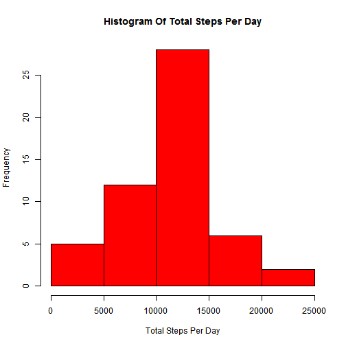
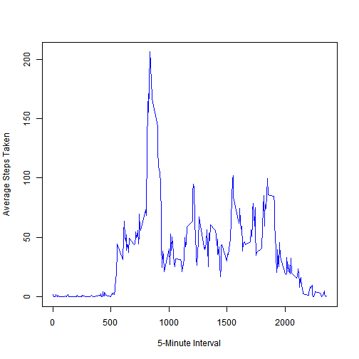
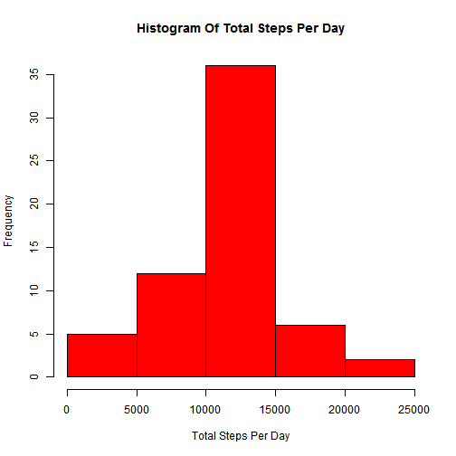

Reproducible Research - Assignment #1
======================================

This is my R Markdown document for Assignment #1 of Reproducible Research.

**Loading and preprocessing the data**

Here, we will download the *Dataset: Activity monitoring data* to our working directory before we can answer the questions in this assignment:


```r
download.file("http://d396qusza40orc.cloudfront.net/repdata%2Fdata%2Factivity.zip", destfile = "./files.zip")
unzip("./files.zip")
```

After it's downloaded, we'll load the data into the variable *A*:


```r
A <- read.csv("./activity.csv")
```

Let's begin the assignment:

**Question 1: What is mean total number of steps taken per day?**

First, as it was suggested, we will ignore the missing values in the dataset. I've ommited the missing values and store the data in the variable *B*. Then, we will total the number of steps per day and store this in the variable *C*.


```r
B <- na.omit(A)
C <- aggregate(B$steps, by=list(B$date), sum)
C <- data.frame(date=C$Group.1, steps=C$x)
```

With *C*, let's make a histogram of the total number of steps taken each day:


```r
hist(C$steps, xlab="Total Steps Per Day", col="red", main = "Histogram Of Total Steps Per Day")
```

 

This is the mean of the total number of steps taken each day:


```r
mean(C$steps)
```

```
## [1] 10766
```

This is the median of the total number of steps taken each day:


```r
median(C$steps)
```

```
## [1] 10765
```


**Question 2: What is the average daily activity pattern?**

Before we make a time series plot, we will take the average steps taken per interval:


```r
D <- aggregate(B$steps, by=list(B$interval), mean)
D <- data.frame(interval=D$Group.1, avg_steps=D$x)
```

With *D*, let's make our time series plot:

```r
plot(D$interval, D$avg_steps, type="l", xlab= "5-Minute Interval", ylab="Average Steps Taken", col = "blue")
```

 

This is the 5-minute interval that contains the maximum average number of steps:

```r
subset(D, avg_steps==max(D$avg_steps))
```

```
##     interval avg_steps
## 104      835     206.2
```


**Imputing missing values**

This is the total number of missing values in the dataset:

```r
E <- subset(A,is.na(A$steps)==TRUE)
nrow(E)
```

```
## [1] 2304
```

For filling in al of the missing values, I have chosen to backfill them with the mean for the given 5-minute interval. I will store this new dataset in *F*:

```r
F <- merge(E,D,by="interval")
F <- data.frame(steps=F$avg_steps,date=F$date,interval=F$interval)
```

We will create a new set *G* that will combine data from *F* with *B*:

```r
G <- rbind(F,B)
H <- aggregate(G$steps, by=list(G$date), sum)
H <- data.frame(date=H$Group.1, steps=H$x)
```

With *H*, let's make a histogram of the total number of steps taken each day:


```r
hist(H$steps, xlab="Total Steps Per Day", col="red", main = "Histogram Of Total Steps Per Day")
```

 

This is the mean of the total number of steps taken each day:


```r
mean(H$steps)
```

```
## [1] 10766
```

This is the median of the total number of steps taken each day:


```r
median(H$steps)
```

```
## [1] 10766
```

**Question 3: Are there differences in activity patterns between weekdays and weekends?**

Let's introduce a new column that explains which dates are weekdays and which are weekdays:


```r
I <- data.frame(steps=G$steps, date=G$date, interval = G$interval, dow = weekdays(as.Date(G$date)))
week <- data.frame(dow = c("Monday", "Tuesday", "Wednesday", "Thursday", "Friday", "Saturday", "Sunday"),weekgroup = c("weekday","weekday","weekday","weekday","weekday","weekend","weekend"))
I <- merge(I,week,by="dow")
```

Split by weekday or weekend, let's take the average number of steps for each 5-minute interval and sTore it in J:


```r
J <- aggregate(I$steps, by=list(I$weekgroup,I$interval), mean)
J <- data.frame(weekgroup=J$Group.1, interval = J$Group.2, avg_steps=J$x)
```

Here is the panel plot containing a time series plot of the 5-minute interval and the average number of steps taken, averaged across all weekday days or weekend days.


```r
library(lattice) 
```

```
## Warning: package 'lattice' was built under R version 3.0.3
```

```r
xyplot(J$avg_steps~J$interval|J$weekgroup, type ="l",layout=c(1,2), ylab="Number of steps", xlab="Interval")
```

 

```r
knit2html()
```

```
## Error: object 'input2' not found
```


